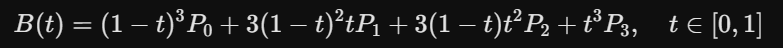

# CurveCraft: Interactive Bézier Curve Sandbox
---
An intuitive, web-based tool to visualize and manipulate Bézier curves in real-time. This project is built directly on mathematical Bézier formulas, providing dynamic auxiliary lines and anchor points.
一款直覺的網頁版工具，用於即時視覺化和操控貝塞爾曲線。該專案直接基於數學上的貝塞爾公式構建，提供動態輔助線和錨點。

### How it Works
The curve is calculated using the standard Bézier formula. For a cubic Bézier curve, the mathematical representation is:
本專案核心演算法基於標準貝茲曲線公式。以三次貝茲曲線為例，其數學公式為：

### Tech Stack
* HTML5 (Canvas API)
* CSS3

### Getting Started
[Bézier - github.io](https://wallfulplus.github.io/bezier-canvas-interactive)

### Demonstration
[Demonstration - youtube.com](https://youtu.be/uZjk96p2AwA)